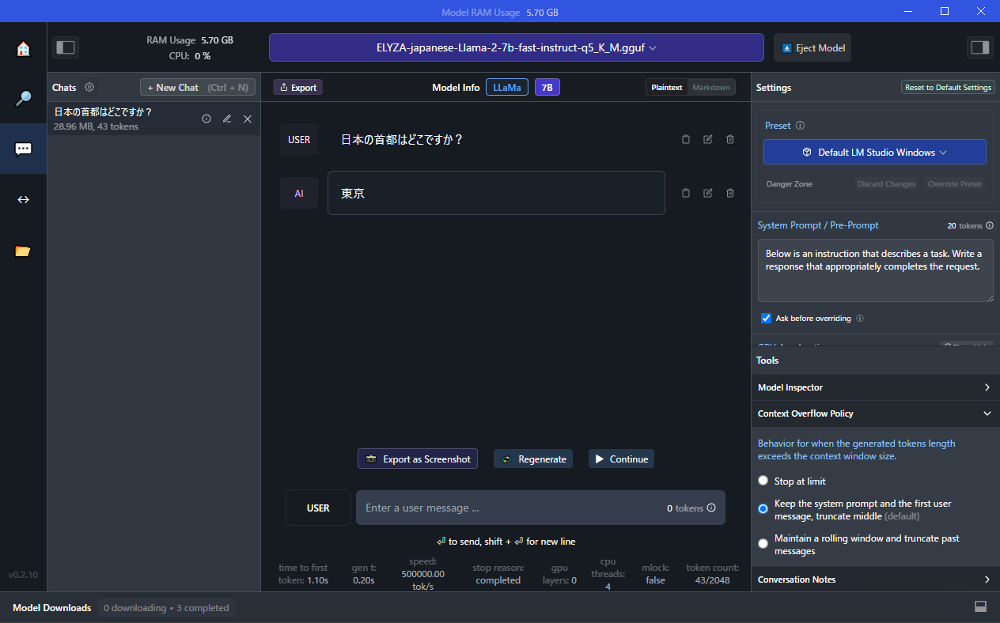

# LM_Studio_example1

## 概要

大規模言語モデル( LLM ) をローカル環境で実行できるデスクトップアプリケーションの LM Studio を動かしてみた。

LM Studio  
https://lmstudio.ai/  

* 大規模言語モデル( LLM ) をローカル環境で実行できるデスクトップアプリケーション
* 好きな LLM をダウンロードし、ChatGPT のようなインターフェースで利用できる
* 完全にオフラインで実行できる(※)
* GPU が無くても CPU のみで実行できる

※公式 FAQ より  
Q: LM Studioはデータを収集しますか?  
A: いいえ。ローカル LLM を使用する主な理由の 1 つはプライバシーであり、LM Studio はそのために設計されています。データはプライベートで、マシンに対してローカルなままです。




## インストール　※作成中
※以下、バージョン 0.2.10 の Windows の場合

* https://lmstudio.ai/ にアクセス
* Download LM Studio for Windows をクリック

LM+Studio-0.2.10+Setup.exe をダウンロード
LM+Studio-0.2.10+Setup.exe を実行

いきなり LM Studio が起動するが

C:\Users\ユーザー名\AppData\Local\LM-Studio に必要なファイルがインストールされる
また、デスクトップにショートカットが作成される

上記のLM-Studioは別の場所に移動させても動作する　※当然ショートカットは機能しなくなるので、そちらはショートカットを作成し直す

セッションキャッシュなどが以下に保存される
C:\Users\ユーザー名\.cache\lm-studio

↓チャットの設定でキャッシュ残すかと残す場所設定できるから不要かも  
シンボリックリンク置いておけば別の場所に移せる  
※コマンド例
```bat 
mklink /D "C:\Users\ユーザー名\.cache\lm-studio" "D:\lm-studio"
```


ダウンロードしたモデルはデフォルトでは以下に保存されるが変更可能
C:\Users\ユーザー名\.cache\lm-studio\models